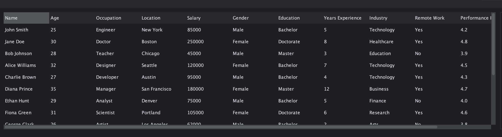
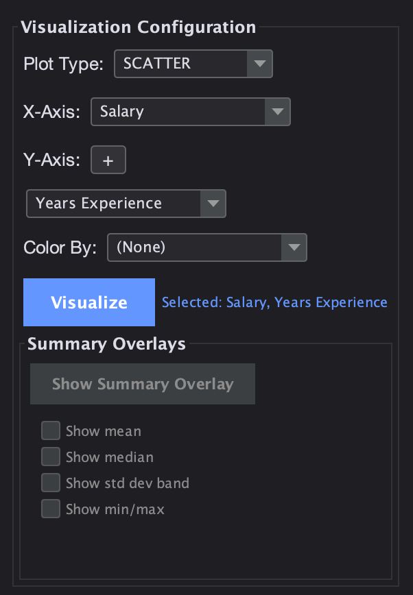
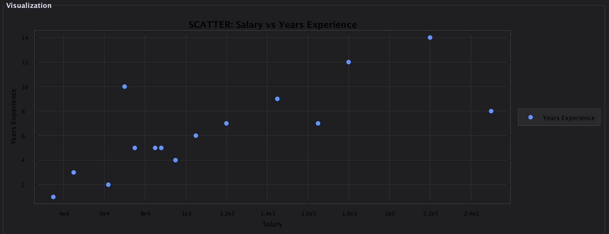

# Statistical Analysis Platform

A desktop application for exploratory data analysis. Load a dataset from a CSV file or a web API, clean and validate its columns, search and filter rows, compute summary statistics, and generate plots — without writing any code.

Built in Java with Swing, following Clean Architecture. Originally developed as a six-person team project for CSC207 (Software Design) at the University of Toronto.

> **Note:** This repository is a fork of the team's shared repository (`rqees/team-project`). See [My Contribution](#my-contribution) for a breakdown of the work I personally authored.

---

## Screenshots

**Dataset table view** — load a CSV or pull from an API, then browse and search the rows.



**Visualization** — configure a plot by assigning columns to roles, then render it.

<p align="center">
  
</p>



---

## Features

- **Load data** from a local CSV file or directly from a web API
- **Clean and validate** columns with type-aware validators (numeric, categorical, boolean, date), flagging missing cells and type mismatches
- **Search and filter** rows against column criteria
- **Browse** the dataset in a scrollable, sortable table view
- **Summarize** with descriptive statistics, correlation matrices, and outlier detection
- **Visualize** distributions and relationships (histograms, scatter plots) via XChart
- **Save** cleaned datasets back to disk

## Tech stack

| | |
|---|---|
| Language | Java 16 |
| UI | Swing + FlatLaf |
| Charting | XChart 3.8.8 |
| Data | org.json (API ingestion), CSV parsing |
| Testing | JUnit 4 & 5, Mockito |
| Build | Maven |

## Architecture

The codebase follows Clean Architecture, with dependencies pointing inward:

```
entity/              Core domain objects (DataSet, Column, DataRow, SummaryMetric)
use_case/            Application logic — one package per use case, each with an
                     Interactor and input/output boundary interfaces
interface_adapter/   Controllers, Presenters, and View Models per use case
view/                Swing components
data_access/         Gateway implementations (file I/O, API client, in-memory stores)
app/                 Dependency wiring and entry point
```

Every use case is a vertical slice: an interactor that depends only on boundary
interfaces, a controller that translates UI events into input data, and a presenter
that pushes results into a view model. Views never touch entities directly.

## Running it

Requires JDK 16+ and Maven.

```bash
git clone https://github.com/winstonnfeng/Statistical-Analysis-Platform.git
cd Statistical-Analysis-Platform
mvn clean install
mvn exec:java -Dexec.mainClass="app.Main"
```

Run the test suite with:

```bash
mvn test
```

---

## My Contribution

The project was built by a team of six. My work was concentrated in two feature areas
and the test suite:

**Search use case** — implemented end-to-end: `SearchInteractor` and its input/output
boundaries, `SearchController`, `SearchPresenter`, and `SearchViewModel`.

**Table display use case** — implemented end-to-end: `DisplayTableInteractor` and
boundaries, the `Table` controller/presenter/view-model layer, and `DataSetTableView`.

**Architectural refactor** — reworked the view layer so it no longer accessed entity
objects directly, routing all data through view models to restore the Clean Architecture
dependency rule.

**Testing** — wrote `SearchInteractorTest` and `TableInteractorTest`, reaching 100%
coverage on both interactors, using Mockito to stub gateway dependencies.

I also participated in code review across the team's pull requests.

## Team

Winston Feng · Dohyeon Nam · Shiven Aggarwal · Raees Kabir · Denis Mathew Fat Shin Li Ping Kam · Navdeep-Singh Gill
